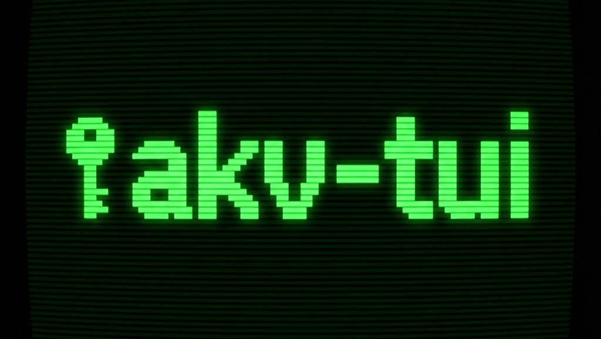

<p align="center">
  
</p>

# Azure Key Vault TUI

A terminal user interface (TUI) for managing Azure Key Vault secrets, written in Rust.


## Features

- **Vault Discovery**: Automatically discovers accessible Key Vaults in your Azure subscription.
- **Secret Management**:
    - List secrets with fuzzy search.
    - View secret values.
    - Add new secrets.
    - Edit existing secrets.
    - Delete secrets (soft-delete).
- **Clipboard Integration**: Copy secret values to clipboard with a single keypress.
- **Caching**: Caches secrets and tokens for improved performance and reduced API calls.
- **Cross-Platform**: Runs on Linux, macOS, and Windows.

## Installation

### Option 1: One-line Installer (Recommended)
For Linux and macOS users, you can install the latest release with a single command:

```sh
curl -fsSL https://raw.githubusercontent.com/jkoessle/akv-tui-rs/main/install.sh | sh
```

### Option 2: Cargo
If you have Rust installed, you can install via Cargo:

```sh
cargo install akv-tui-rs
```

### Option 3: Manual Download
You can download the pre-built binary for your platform from the [Releases](https://github.com/jkoessle/akv-tui-rs/releases) page.

### Build from Source

#### Prerequisites (Linux)
On Linux, you might need to install XCB development libraries:
```bash
sudo apt-get install libxcb-shape0-dev libxcb-xfixes0-dev
```

#### Steps
1. Clone the repository:
   ```bash
   git clone https://github.com/jkoessle/akv-tui-rs.git
   cd akv-tui-rs
   ```
2. Run directly:
   ```bash
   cargo run
   ```
3. Or install globally:
   ```bash
   cargo install --path .
   ```

## Usage

1. **Authenticate**: Run `az login` in your terminal if you haven't already.
2. **Start the Tool**: Run `akv` (or `cargo run`).
3. **Select Vault**: Use arrow keys or `j`/`k` to select a vault from the list and press `Enter`.
4. **Manage Secrets**:
    - **Navigation**: `j`/`k` or `Up`/`Down` to navigate the list.
    - **Search**: Press `/` to enter search mode. Type to filter secrets. `Esc` to clear/exit search.
    - **Copy Value**: Press `Enter` on a selected secret to copy its value to the clipboard.
    - **Add Secret**: Press `a` to add a new secret.
    - **Edit Secret**: Press `e` to edit the selected secret.
    - **Delete Secret**: Press `d` to delete the selected secret.
    - **Refresh**: Press `r` to refresh the secret list for the current vault.
    - **Switch Vault**: Press `v` to go back to the vault selection screen.
    - **Quit**: Press `q` or `Esc` to exit.

### Keybindings Summary

| Key | Action |
| --- | --- |
| `j` / `↓` | Move selection down |
| `k` / `↑` | Move selection up |
| `Enter` | Select vault / Copy secret value |
| `/` | Enter search mode |
| `a` | Add new secret |
| `e` | Edit selected secret |
| `d` | Delete selected secret |
| `r` | Refresh secrets |
| `v` | Back to vault selection |
| `q` | Quit application |

## Configuration

- **Debug Logging**: Run with `--debug` to enable logging to `azure_tui.log` in the current directory.
  ```bash
  cargo run -- --debug
  ```

## License

This project is licensed under the [Apache License 2.0](LICENSE).
